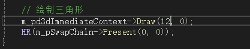
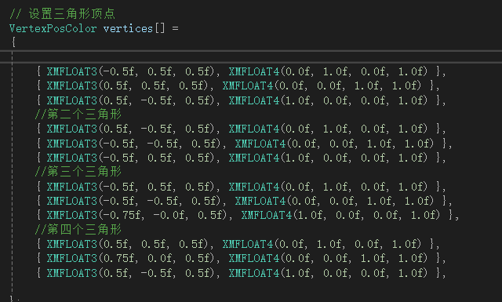
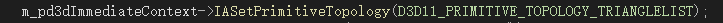
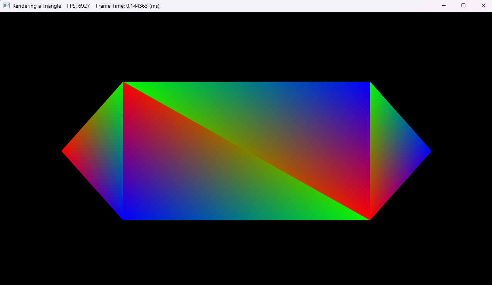

### **<u>关于用DX11绘制一个六边形的主要流程</u>**

（说明：作业在DirectX11-With-Windows-SDK-master1\DirectX11-With-Windows-SDK-master\Project 01-09\02 Rendering a Triangle上）

首先，绘制一个六边形有两种方法，根据规定的图元类型不同，可以分为

**按线段进行装配**（图元类型为`D3D11_PRIMITIVE_TOPOLOGY_LINELIST`）

**按三角形进行装配**（图元类型为`D3D11_PRIMITIVE_TOPOLOGY_TRIANGLELIST`）

这里我采用的是第二种绘制方法

#### 主要流程

通过拆解常见的六边形可以得知，一个六边形可以由4个标准的三角形组成。因此，想要绘制一个六边形，我们需要在原有代码的基础上修改增添一部分。

首先，先定位到此处

这段代码的主要功能是绘制三角形并进行显示，第一行调用了Direct3D 11 中的立即渲染上下文对象 `m_pd3dImmediateContext` 的 `Draw` 方法。`Draw（12,0）`中的第一个参数代表要绘制的顶点个数，由于4个三角形拥有12个顶点，所以在此处要填上12。第二个参数表示从顶点缓冲区中的第 0 个顶点开始绘制。

重新确定要绘制的顶点个数后，定位到

此处用于设置三角形的顶点位置，在设置三角形顶点位置时，要注意三角形的顶点摆放要按照顺时针来放置

分别设定好4个三角形的顶点位置，确认规定的图元类型为`D3D11_PRIMITIVE_TOPOLOGY_TRIANGLELIST`

最后确认其它部分无误后输出结果

六边形绘制成功。