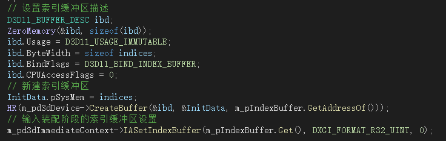
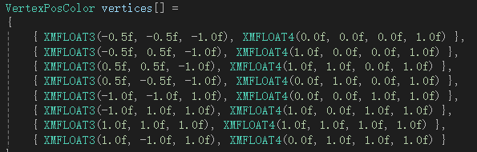
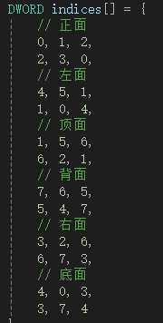
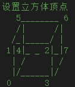
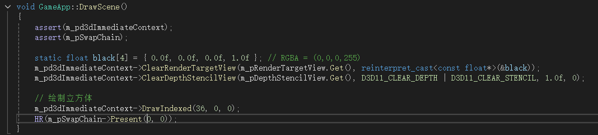
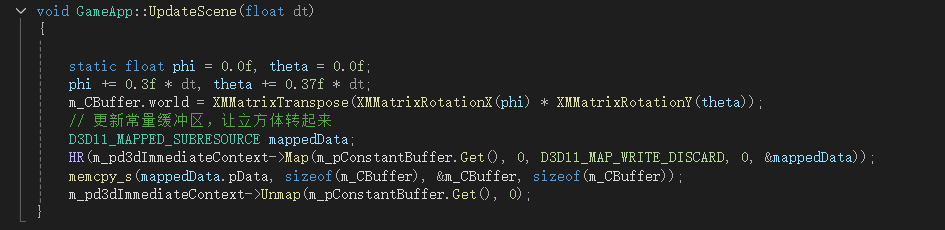
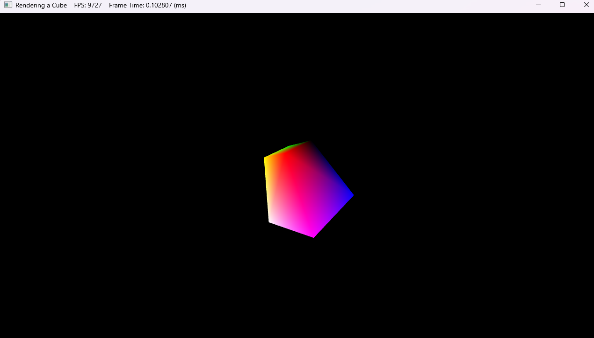

### **<u>关于用DX11绘制四棱台的主要流程</u>**

（**作业文件存放在实践题作业**<u>\DirectX11-With-Windows-SDK-master1\DirectX11-With-Windows-SDK-master\Project 01-09\03 Rendering a Cube</u>）

#### 基础思路

与处在二维平面的三角形不同，四棱台作为一个立体结构，存在于三维世界中。我们需要修改某些特定的数值，使得原先处于二维平面的顶点位置被分散到三维中，这里要用到的就是深度值。

观察用于描述顶点的坐标结构

可以发现其由3个参数共同组成，第一个参数用于描述顶点在平面上的x轴坐标位置，第二个参数用于描述顶点在平面上的y轴坐标位置，最后一个就是深度值。深度值在图形渲染中用于描述顶点位置相对于相机的远近距离，深度值越小，代表该顶点里相机越近，深度值越大代表该顶点里相机越远。因此，我们可以运用不同顶点的深度值大小，来完成在三维中立体图形的构建。

#### **选择图元类型**

想好要怎么表示三维图像后，要确定使用那种图元类型来绘制四棱台，根据前面绘制六边形的经验，选择`D3D11_PRIMITIVE_TOPOLOGY_TRIANGLELIST`可以更直观的看到四棱台。

#### **索引缓冲区**

在绘制六边形中，得知了绘制一个六边形需要四个三角形的参与，而一个三角形拥有3个顶点，意味着我们要确定12个顶点的坐标。对于立体图形的四棱台来说，一共拥有六个四边形，总共需要12个三角形，也就是36个顶点，不管对于工作量还是确定顶点位置来说是无比沉重的，并且会占用大量的顶点缓冲区的空间。为了解决这个问题，引入索引缓冲区和索引数组，可以有效减少顶点缓冲区的占用空间，避免提供大量重复的顶点数据。

在使用索引数组之前，先来初始化顶点数组。立方体是一种三维的正多面体，从空间几何的角度来看，要完整地定义一个立方体在三维空间中的形状，就需要明确其各个角点的位置，也就是顶点的位置。而立方体恰好有 8 个角点，所以需要 8 个顶点来精确描述它的形状和位置。

方便理解，我们可以把不同深度值看作是不同的平面，相同的深度值则表明顶点处在同一个平面上。四棱台可以看作是两个平面，一个离相机较近，一个离相机较远。分别定为-1和1。离相机较近的平面，设为小四边形，另外一个设为大四边形。

在初始化顶点数组以后，根据每个四边形一组的规则，可以构建索引数组

在计算机图形学里，图形的渲染通常是基于三角形来进行的。要渲染一个立方体，就需要把立方体的每个面分解成多个三角形，然后利用这些三角形来构建整个立方体的表面。虽然立方体的每个面看起来是一个正方形，但在渲染时，每个正方形面会被拆分成两个三角形。例如，一个正方形面可以由顶点 `(0, 1, 2)` 和 `(2, 3, 0)` 这两个三角形组成。

#### 绘制阶段

现在我们要绘制12个三角形，构成立方体，方法实现如下

为了让其每个面都能看到，可以让其旋转起来。

#### **最终结果**

