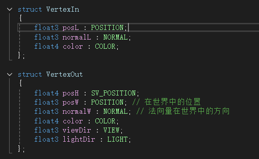
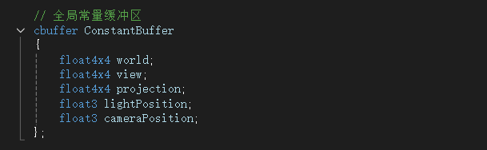
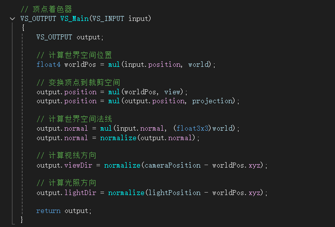
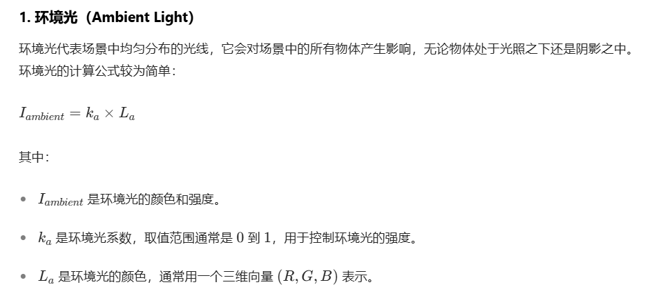
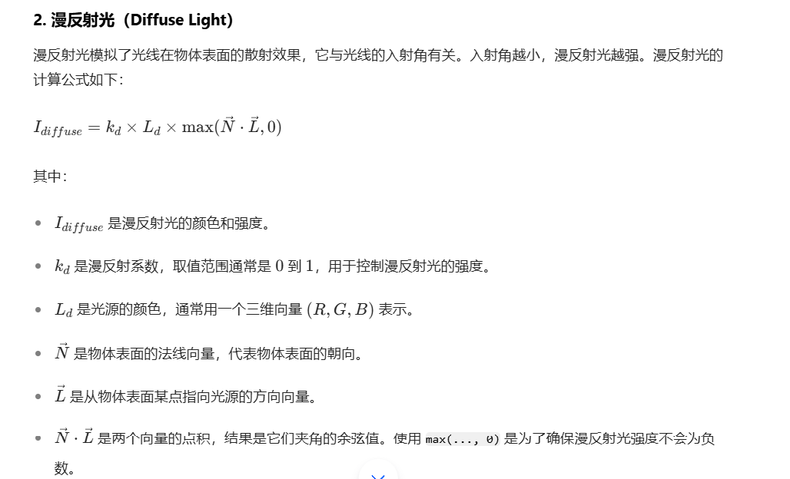
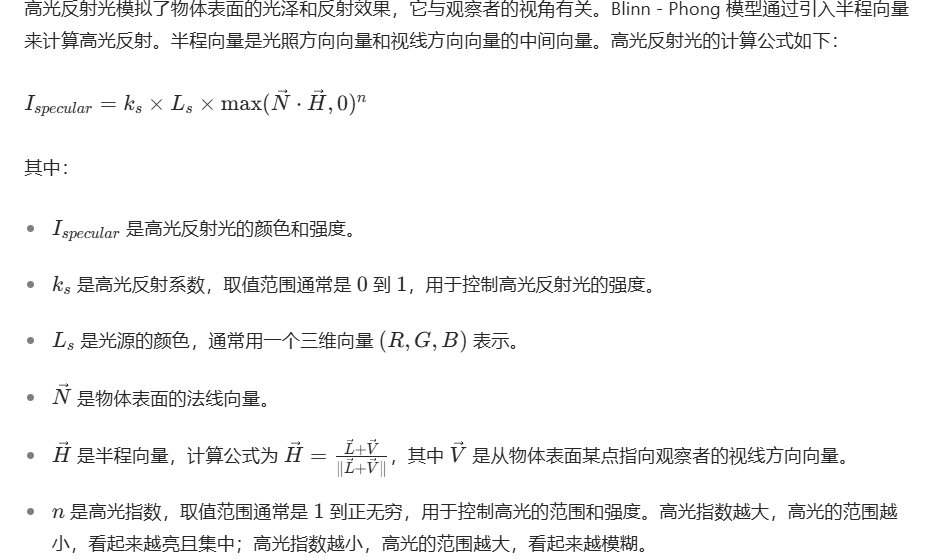
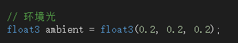
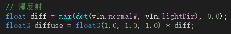
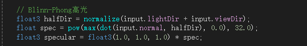

### 使用HLSL编写**`Blinn-Phong`光照模型**

<u>（`ps`：本项目根据AI提供的模板和07项目中对应代码改编得来，AI模板一并包含在项目中）</u>

主要步骤：1.定义输入输出结构体 2.定义常量缓冲区 3.编写顶点着色器 4.编写像素着色器

#### 1.定义输入输出结构体

我们可以借助以往项目（project07）的信息，来定义输入输出结构体应有的结构，例如，颜色顶点位置，法线，世界空间位置，局部空间位置等等。但是观察07的输入输出结构体，如果我们想要正确的编写出BP光照模型，则还需要引入视线方向和光照方向

`float3 viewDir : VIEW;//视线方向`
`float3 lightDir : LIGHT;//光照方向`

如图为输入输出结构体：

#### 2.定义常量缓冲区

同样是借助07项目的信息，我们来定义一个常量缓冲区，借助它来帮我们暂时存放信息，一般来说，需要定义变换矩阵（世界矩阵，视图矩阵，投影矩阵），光源位置和相机位置等等。在这里，我们仿照07项目，但还需要加上相机位置和光源信息，来帮助我们存储信息，便于进行光照计算

#### 3.编写顶点着色器

一般顶点着色器用来进行变换和光照计算，在07中，他已经列出了计算世界空间位置，变换顶点到裁剪空间，计算世界空间法线。要实现光照效果，我们还要计算视线的方向，计算光照的方向

`// 计算视线方向`
`vOut.viewDir = normalize(cameraPosition - posW.xyz);`

`// 计算光照方向`
`vOut.lightDir = normalize(lightPosition - posW.xyz);`

这些向量将被传递给像素着色器，用于计算环境光、漫反射光和高光反射光。

#### 4.编写像素着色器

编写**`Blinn-Phong`光照模型**，我们首先要知道模型中有什么东西，一般是环境光，漫反射光，高光反射光。通过资料查询，得到每一个光源模型的计算公式：

这里我们确定一个环境光

这里的 `float3(0.2, 0.2, 0.2)` 就相当于 `I ambient`，假设 \(L_a=(1, 1, 1)\)，那么 \(k_a = 0.2\)

这里的 `input.normal` 相当于N，`input.lightDir` 相当于L，`float3(1.0, 1.0, 1.0)` 相当于`Ld`，假设`Kd` = 1

这里的 `input.normal` 相当于N，`input.lightDir` 相当于L，`input.viewDir` 相当于V，`halfDir` 相当于H，`float3(1.0, 1.0, 1.0)` 相当于`Ls`，假设 Ks= 1，n = 32

至此，我们就得到了一个用HLSL编写的**`Blinn-Phong`光照模型**
