### 创建几何体并贴上纹理

作业地址：DirectX11-With-Windows-SDK-master1\DirectX11-With-Windows-SDK-master\Project 01-09\09 Texture Mapping

在创建几何体并贴上纹理之前，根据它已经给出的立方体进行分析，我们可以获得一下步骤。

首先是构建几何体，在教程07中，了解到应该如何构建常用几何模型——使用一系列函数创建所需立方体（创建网格数据，导入数据，建立内存映射关系，放入索引等等具体步骤，这里不过多展开）函数编译创建好存放在`Geometry.h`中，方便随时调用。

创建好几何体以后，接下来就是纹理部分。根据教程给出的源码分析可得（可以通过检索`WoodCreate`所在位置分析可知），我们首先需要定义一个成员变量，

就犹如它先定义了`WoodCreat（ComPtr<ID3D11ShaderResourceView> m_pWoodCrate;//木盒纹理）`。

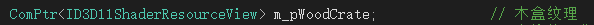

接着检索`WoodCreate`所在位置，定位到`void GameApp::UpdateScene`函数中，观察整个函数，第一部分是选择结构，具体是根据用户选择的显示类型选择输出，例如，选择Box则输出木箱纹理。输出木箱纹理的代码中，确定立方体类型的函数是： `auto meshData = Geometry::CreateBox();`

另外，可以发现之前定义过的木箱纹理也出现在了最后一行中，目的是在木箱上加载出纹理 

`m_pd3dImmediateContext->PSSetShaderResources(0, 1, m_pWoodCrate.GetAddressOf());`

完成这一步之后，我们需要让立方体旋转起来，以便于更好地观察上述步骤是否已经成功

创建一个立方体并且给它贴上纹理的基本步骤就到此，现在，我们试着增加多几个立方体（运用到`Geometry.h`中的立方体）并给它们贴上不同的纹理，另外，我们还可以增添一些步骤，使得纹理也能够旋转起来。

仿照上面的步骤，我们先定义几个纹理贴图，因为要增加三种新的立方体（圆锥，圆柱，球体），所以我们分别定义：

`ComPtr<ID3D11ShaderResourceView> m_pConeCrate;  // 圆锥纹理`

`ComPtr<ID3D11ShaderResourceView> m_pSphereCrate;  // 球体纹理`

`ComPtr<ID3D11ShaderResourceView> m_pCylinderCrate;  // 圆柱体纹理`

我们要让用户自己选择输出哪一个结构，要在`showmode`上增加新的选项，具体是在`enum class ShowMode`中增加三个新定义：Cone，Sphere，Cylinder。

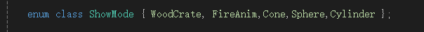

接着，返回到`UpdateScene`中，仿照Mode为Box的结构，分别对三个新的立方体进行处理，例如

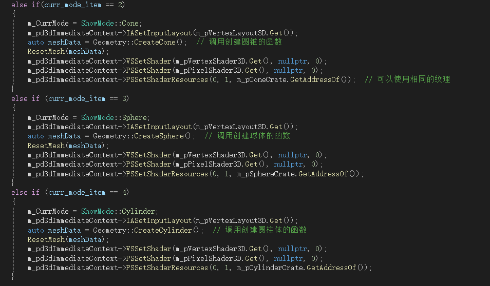

修改`Geometry函数`，改为需要生成的立方体类型

`auto meshData = Geometry::CreateCone();  // 调用创建圆锥的函数`

`auto meshData = Geometry::CreateSphere();  // 调用创建球体的函数`

`auto meshData = Geometry::CreateCylinder();  // 调用创建圆柱体的函数`

另外，如果要更换纹理贴图，则需要修改纹理地址，在初始化阶段，通过更改纹理地址的位置，实现纹理的更换

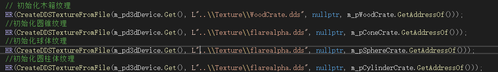

做到这里，已经实现了几何体的构建和贴上纹理，为了方便观察，我们也需要对新的立方体施加方法，让其旋转起来，仿照Box的代码，我们可以写出如下所示：

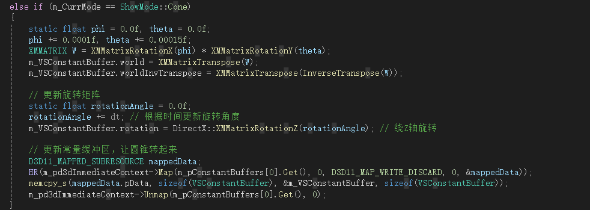

最终附上效果图：

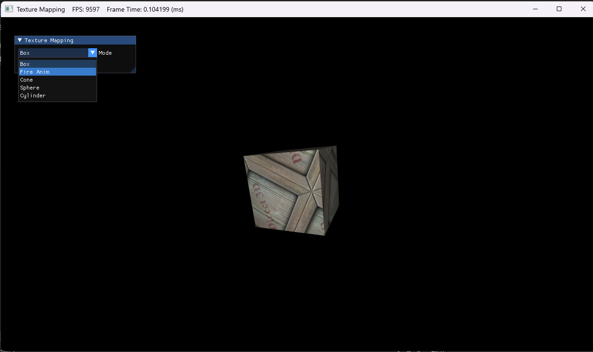
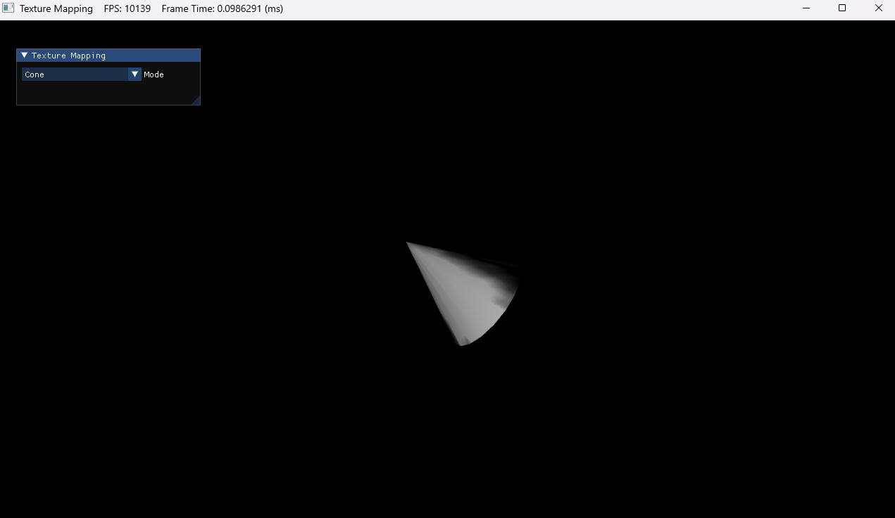

### 使得纹理旋转

作业地址与上一个项目相同

首先分析步骤：1.在常量缓冲区中添加旋转矩阵 2.更新旋转矩阵 3.在着色器中使用旋转矩阵

#### 1.在常量缓冲区中添加旋转矩阵

找到`GameApp.h`头文件，定位到常量缓冲区，添加旋转矩阵

 `DirectX::XMMATRIX rotation; // 添加旋转矩阵`

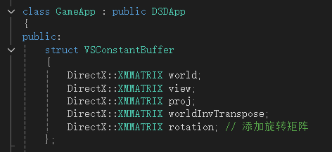

#### 2.更新旋转矩阵

在`GameApp.cpp`中的`UpdateScene`函数中，更新旋转矩阵

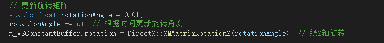

解释代码：首先定义一个旋转角度的变量，让它的数值随着时间变化而变化，接着调用旋转矩阵，让它围绕着z轴旋转。

#### 3.在着色器中使用旋转矩阵

在顶点着色器中修改并使用旋转矩阵。在HLSL文件中，找到`Basic 3D VS.hlsl`文件，添加如下代码，实现纹理旋转功能

`float4 rotatedTex = mul(float4(vIn.tex, 0.0f, 1.0f), rotation);`
`vOut.tex = rotatedTex.xy;`

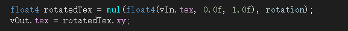

代码解释：`vIn.tex` 是输入的纹理坐标，用来表示纹理上某个点，用`mul`函数，使得`vIn.tex`和旋转矩阵叉乘，不过vIn.Tex一般为float2类型，所以要先将它变换为float4类型。`float4(vIn.tex, 0.0f, 1.0f)` 把 `vIn.tex` 当作四维向量的前两个分量，第三个分量设为 `0.0f`，第四个分量设为 `1.0f`。第四个分量设为 `1.0f` 是因为在齐次坐标系统里，这对于仿射变换（如旋转、平移等）是必需的。

`vOut.tex` 是输出的纹理坐标，同样是二维向量。把旋转后的四维纹理坐标向量 `rotatedTex` 的前两个分量（即 `xy` 分量）提取出来，赋值给输出的纹理坐标 `vOut.tex`。

#### 最终效果

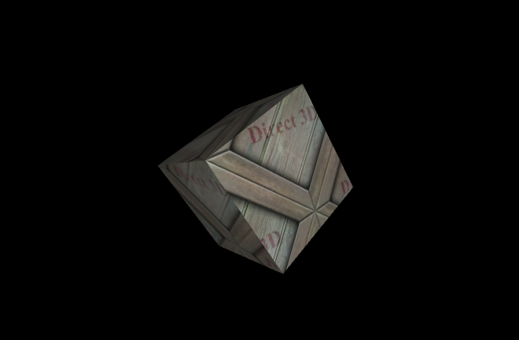

