#### **使用`Imgui`实时控制四棱台的平移、旋转、缩放及颜色变化**

作业位置:`DirectX11-With-Windows-SDK-master1\DirectX11-With-Windows-SDK-master\Project 01-09\06 Use ImGui`

要使用Imgui，首先要生成Imgui静态库，教程自带的项目里已经构建好了imgui的运行环境，项目用的是第二种方法，使用cmake来构建，这里不过多分析。

接着就是要初始化imgui，根据教程，需要在d3dapp.h中添加三个头文件

`\#include <imgui.h> #include <imgui_impl_dx11.h> #include <imgui_impl_win32.h>`

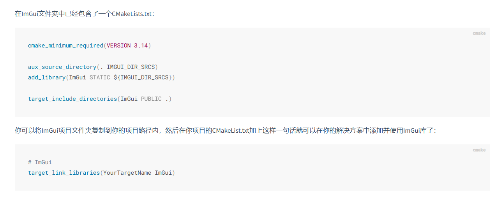

然后在d3dapp.cpp中添加`D3DApp::InitImGui`

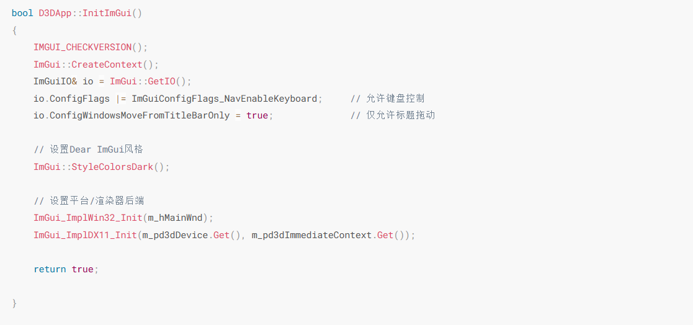

在d3dapp.cpp中在`D3DApp::Init`中调用`InitImGui`

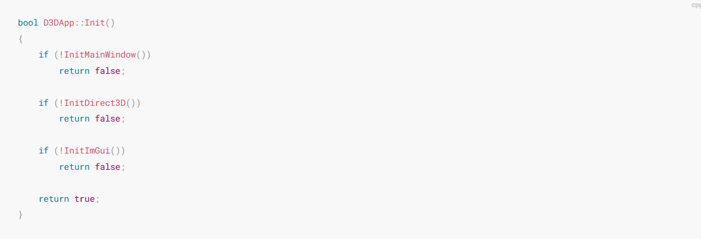

然后在`D3DApp.cpp`的上方添加一句话来引用外部函数：

`extern IMGUI_IMPL_API LRESULT ImGui_ImplWin32_WndProcHandler(HWND hWnd, UINT msg, WPARAM wParam, LPARAM lParam);`

在消息处理函数`D3DApp::MsgProc`的开头添加ImGui的处理：

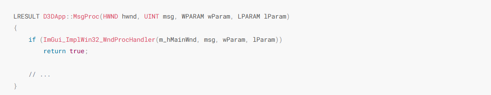

在`D3DApp::Run()`中，我们插入这三个函数用于启动ImGui新一帧的记录与绘制：

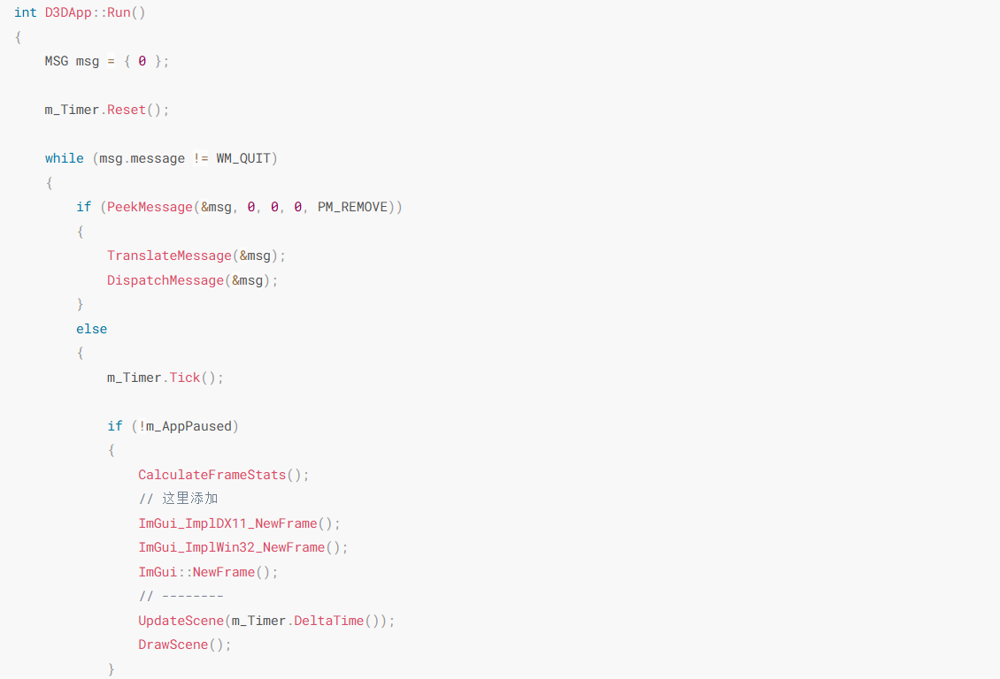
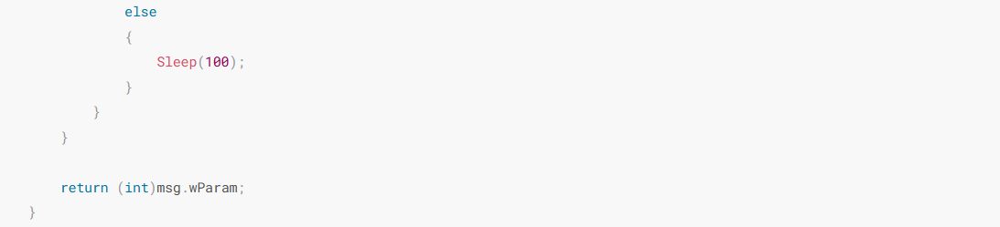

最后就是在`GameApp::DrawScene()`中插入这两句：

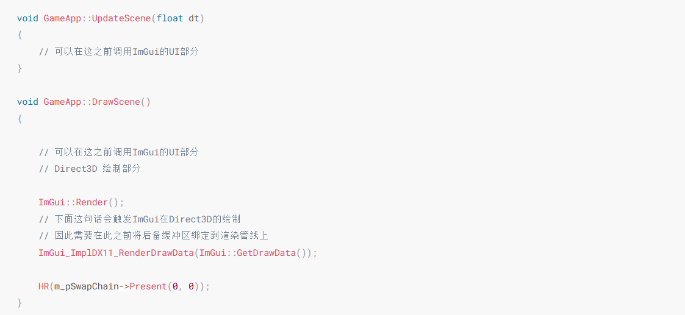

然后就完成了imgui的初始化

为了能够实时控制四棱台的平移、旋转、缩放及颜色变化，需要自定义一个窗口用于操作，本项目的例子：

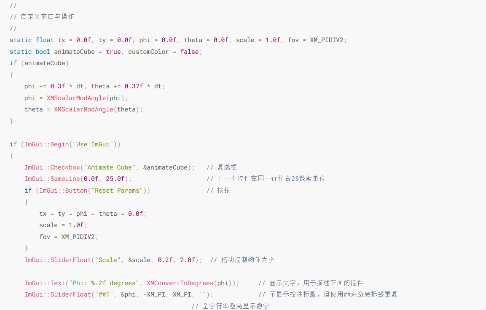
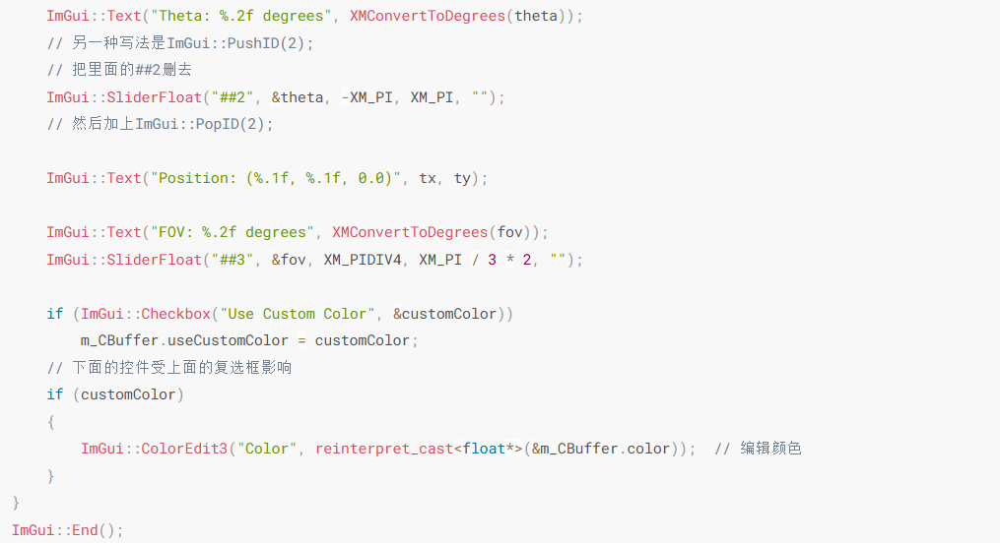

为了能够让立方体显示我们设置的颜色，需要修改着色器

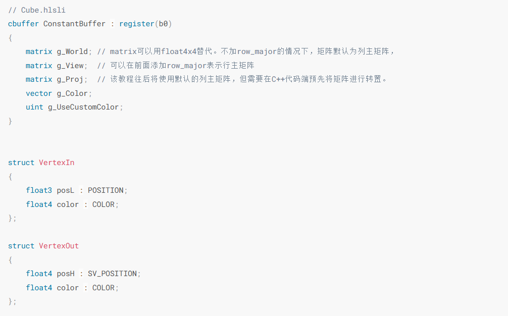
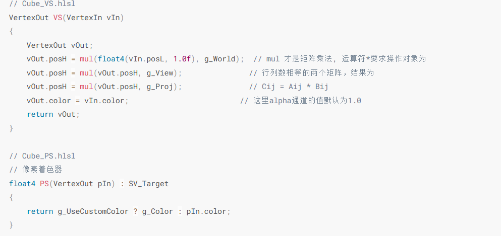

并且更新常量缓冲区

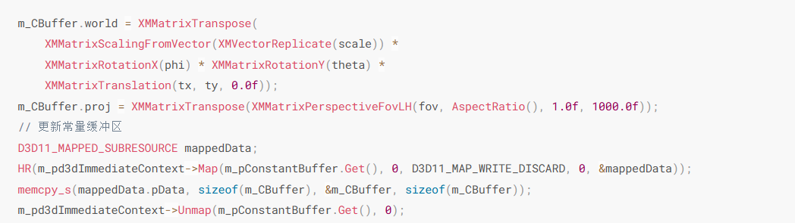

不止通过自定义窗口可以控制物体的平移旋转和缩放，我们还可以利用imgui的io事件获取到一些常用的键鼠事件

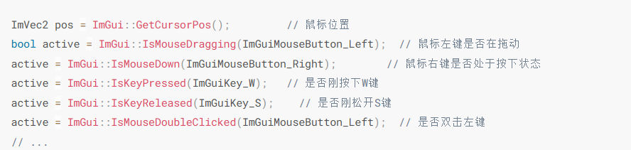

还有一些事件无法通过函数获取的，我们可以使用`ImGuiIO`来获取：

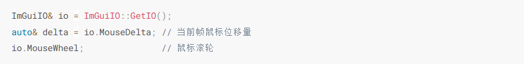

下面展示了利用ImGui的IO事件操作物体：

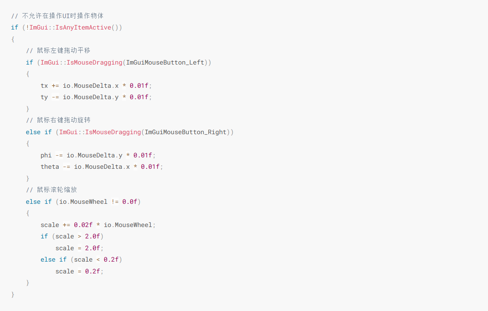

最后结果如图
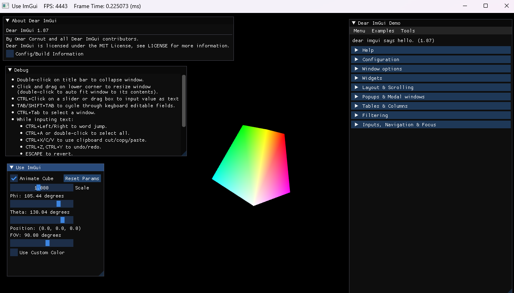
