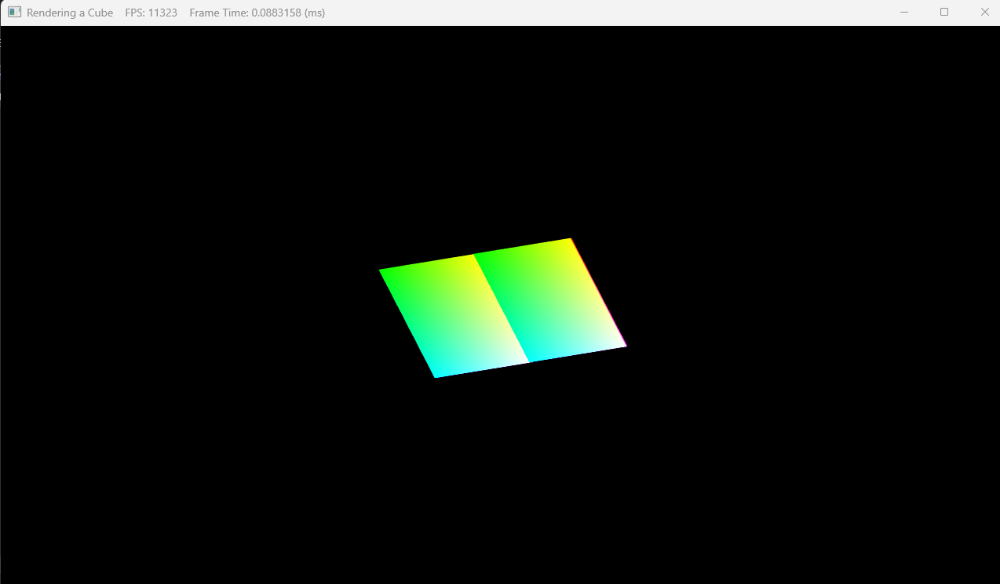

### 对比正交投影和透视投影的区别：

<u>在教程中了解到，正交投影与透视投影最大的区别就是物体在投影平面上大小和形状的区别。在这里，我用DX11绘制两个独立的立方体在更加直观的表现这两者的区别。</u>

上一周已经了解到了，要绘制一个立方体，要首先确定其8个顶点的位置，这里为了更加方便观察出不同投影之间的区别，我们绘制两个独立的立方体分别放置在不同的地方。已知一个平面由两个三角形绘制而成，一个三角形有3个顶点，因此，两个立方体总共需要绘制72个顶点：

同时，还要设置索引数组，以便立方体能够被正确的渲染出来（将立方体的每个顶点设置好数字编号，依据顺时针顺序摆放）

为了更好地观察，我们将两个立方体放置在同一水平面上，其中有一条共用的棱，相互紧贴在一起，下图是确定的顶点坐标：

下一步设置世界矩阵和视图矩阵

`XMMatrixIdentity()`函数用于创建一个 4x4 的单位矩阵。单位矩阵是一个对角线上元素为 1，其余元素为 0 的矩阵，它的特性是任何矩阵与单位矩阵相乘都等于其本身。

代码将世界矩阵 `m_CBuffer.world` 设置为单位矩阵，意味着在这个场景中，几何体不会进行平移、旋转或缩放等变换，其在世界坐标系中的位置和姿态保持不变。

`XMMatrixLookAtLH`函数用于创建一个左手坐标系（LH，Left-Handed）的视图矩阵

- 第一个参数 `XMVectorSet(0.0f, 0.0f, -5.0f, 0.0f)` 表示摄像机的位置，这里摄像机位于世界坐标系中的 `(0, 0, -5)` 点。
- 第二个参数 `XMVectorSet(0.0f, 0.0f, 0.0f, 0.0f)` 表示摄像机所看向的目标点，即摄像机的视线方向指向世界坐标系的原点 `(0, 0, 0)`。
- 第三个参数 `XMVectorSet(0.0f, 1.0f, 0.0f, 0.0f)` 表示摄像机的向上方向，这里设置为 `(0, 1, 0)`，即沿 Y 轴正方向。

接下来设置两种投影类别

`XMMatrixOrthographicLH`函数用于构建左手坐标系下的正交投影矩阵

- 该函数的参数意义如下：
  - 前两个参数 `10, 10` 分别代表投影窗口在 X 轴和 Y 轴方向的宽度和高度。
  - 第三个参数 `1.0f` 是近裁剪平面的距离，意思是距离摄像机小于这个值的物体不会被渲染。
  - 第四个参数 `1000.0f` 是远裁剪平面的距离，即距离摄像机大于这个值的物体不会被渲染。

`XMMatrixPerspectiveFovLH`函数用于创建左手坐标系下的透视投影矩阵

- 该函数的参数意义如下：
  - `XM_PIDIV2` 代表垂直视角，这里是 \(\frac{\pi}{2}\) 弧度（也就是 90 度），它决定了摄像机垂直方向的视野范围。
  - `AspectRatio()` 是屏幕的宽高比，它保证了物体在投影后不会出现拉伸或压缩的情况。
  - `1.0f` 同样是近裁剪平面的距离。
  - `1000.0f` 是远裁剪平面的距离。

首先使用第一种投影矩阵-正交投影矩阵，输出得到结果如下图：

接着使用第二种投影矩阵-透视投影矩阵，输出得到结果如下：

对比两图，很明显的发现，在正交投影矩阵下，立方体的大小和形状不会随着与相机的距离远近发生任何变化，在某一方向，可以很明显地看到原本较远的立方体大小与较近的立方体大小相同。在透视投影矩阵下，立方体的大小和形状会随着与相机的距离远近发生对应的变换，可以很明显的看出两个立方体的大小差别。