#### 绘制天空盒

首先我们要获取环境贴图，可以在网上搜索到很多关于天空盒的贴图，将他们下载下来后，按照教程的方法进行处理。

教程给我们提供了三种方法

1. 已经创建好的`.dds`文件，可以直接通过`DDSTextureLoader`读取使用
2. 6张天空盒的正方形贴图，格式不限。（暂不考虑只有5张的）
3. 等距圆柱投影表示的2D展开图像。与前面两种的实现不同

这里我们用第一种方法来获取环境贴图

因为教程中已有步骤，所以在这里跳过了。得到环境贴图如下

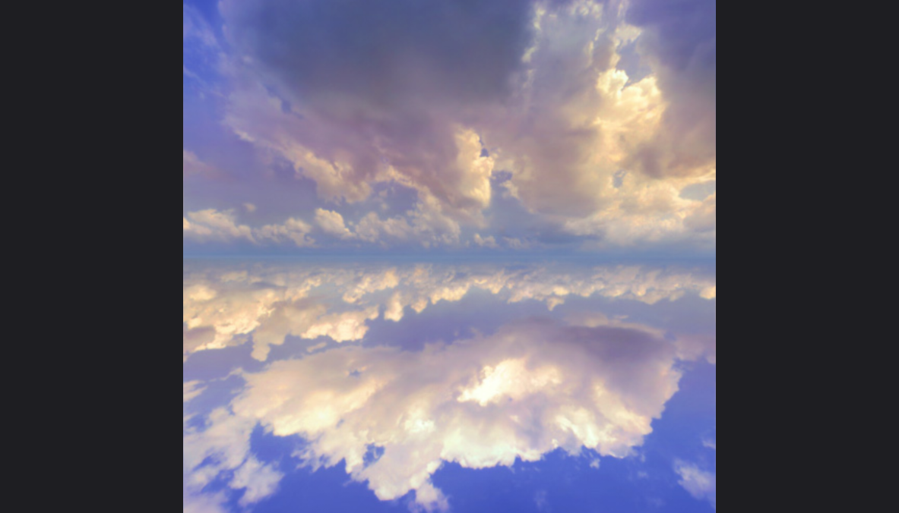

不过到这里发现，如果想要把刚获得的贴图在项目里面使用的话，需要用`cmake`再构建一遍项目，步骤有点繁琐，所以在这里我就转用了项目文件里面可以使用的环境贴图了。

绘制天空盒需要以下准备工作：

1. 将天空盒载入HLSL的`TextureCube`中
2. 在光栅化阶段关闭背面消隐(正面是立方体向外的面，但摄像机在内部)
3. 在输出合并阶段的深度/模板状态，设置深度比较函数为小于等于，以允许深度值为1的像素绘制

首先是初始化天空盒的效果，在`skyboxeffect`中进行初始化，此步骤会创建顶点着色器、像素着色器、顶点布局以及通道等

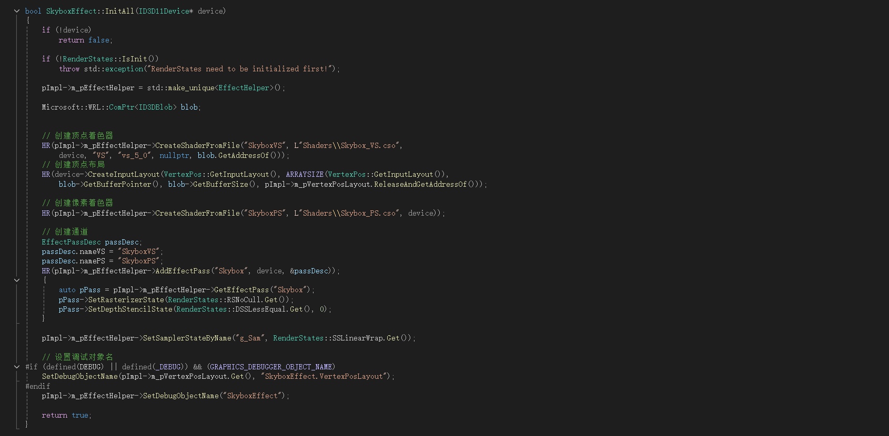

然后就是在`GameApp Init`中初始化天空盒的纹理

有关于在各个场景下的效果：daylight，sunset，desert（修改环境贴图也是在这里进行修改）

在这里我们对daylight进行场景的修改，用教程中提到的第一种方法，直接是用已经构建好的环境贴图，但不知道为什么，依旧会提示报错，那我们就仿照desert的方法进行修改，更换地址位置，最后我们得到想要的效果

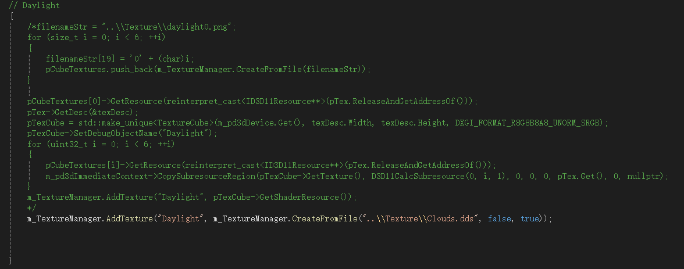

同样的，要初始化天空盒的模型，初始化游戏对象：

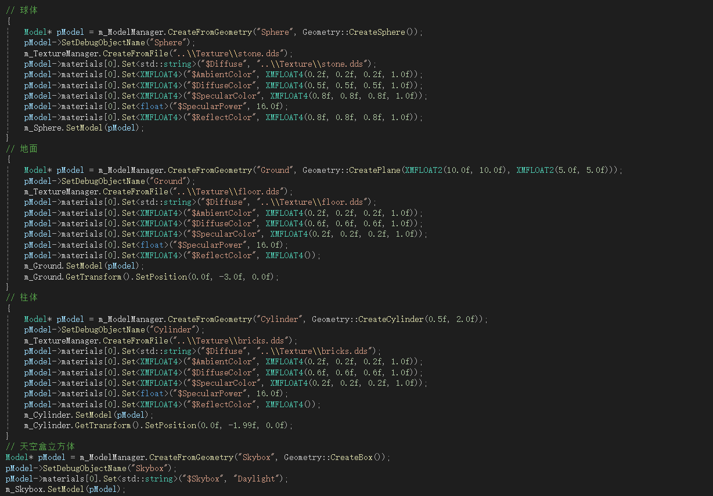

初始化摄像机位置和光源：

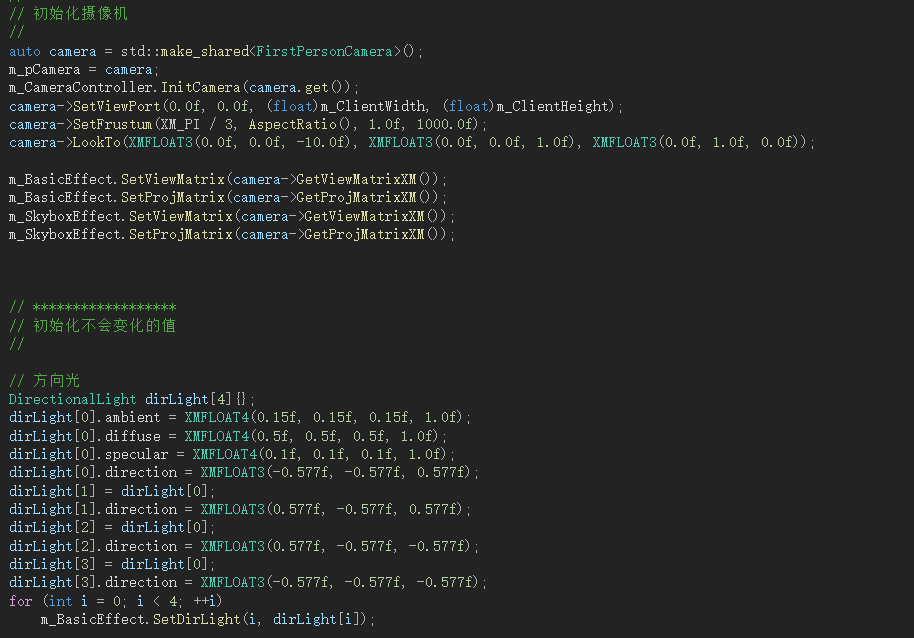

最后进行模型的绘制：

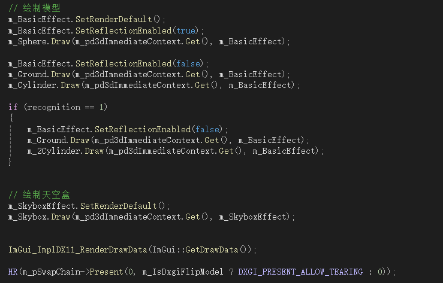

得到天空盒：

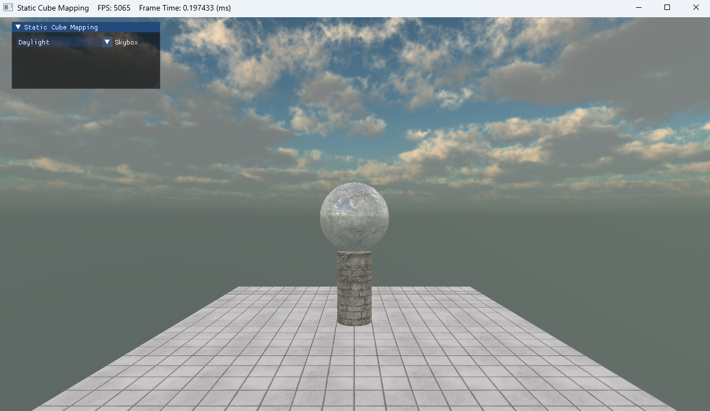

#### 实现在第一人称下拾取、破坏、放置方块（MC）（提示：使用**碰撞检测**及**鼠标拾取**）。

在天空盒的绘制中，其实已经实现了第一人称的相机视角，，也就是初始化摄像机的部分

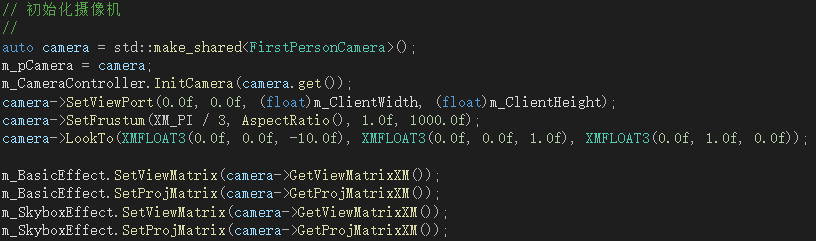

要实现用鼠标和键盘来控制视角的转换，这需要更新摄像机的状态：

`m_CameraController.InitCamera(camera.get());`对相机控制器进行初始化，让它能够操控指定的相机对象，在 `InitCamera` 函数里，会进行一些额外的初始化操作，像设置默认的移动速度、旋转速度等。

然后是更新效果的视图矩阵，这样，在渲染时，场景中的物体和天空盒会根据摄像机的位置和方向进行正确的渲染，从而呈现出第一人称视角的效果。

`m_BasicEffect.SetViewMatrix(m_pCamera->GetViewMatrixXM());`
`m_BasicEffect.SetEyePos(m_pCamera->GetPosition());`

`m_SkyboxEffect.SetViewMatrix(m_pCamera->GetViewMatrixXM());`

那么，如何实现拾取和破坏呢（放置方块弄了好久都没搞定，等到最终考核后有时间的话继续补救）

这里就要用到教程里面提供的碰撞检测了，原理就是从鼠标的位置创建一条射线贯穿整个平面，通过碰撞检测判断射线和物体的包围盒或者它本身有没有相交。如果有相交，那么就能实现拾取的操作了，当识别到鼠标位于物体上方（即射线相交）并同时按下鼠标左键，则实现拾取的操作。

首先获取鼠标的位置，生成一条射线

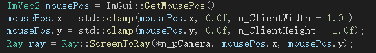

然后是射线与物体的碰撞检测：

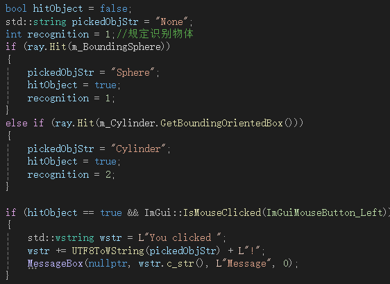

当拾取成功后，就会弹窗提示“You clicked xxx”

然后是破坏方块，其实是将物体转移到视图之外，让人们看不见。

首先定义几个变量方便记录状态。

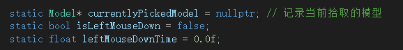

在识别到物体后，当左键被持续按下时，且累计时长超过一秒，会根据recognition的值将对应的物体移动到（`(1000.0f, 1000.0f, 1000.0f)`），模拟破坏操作。

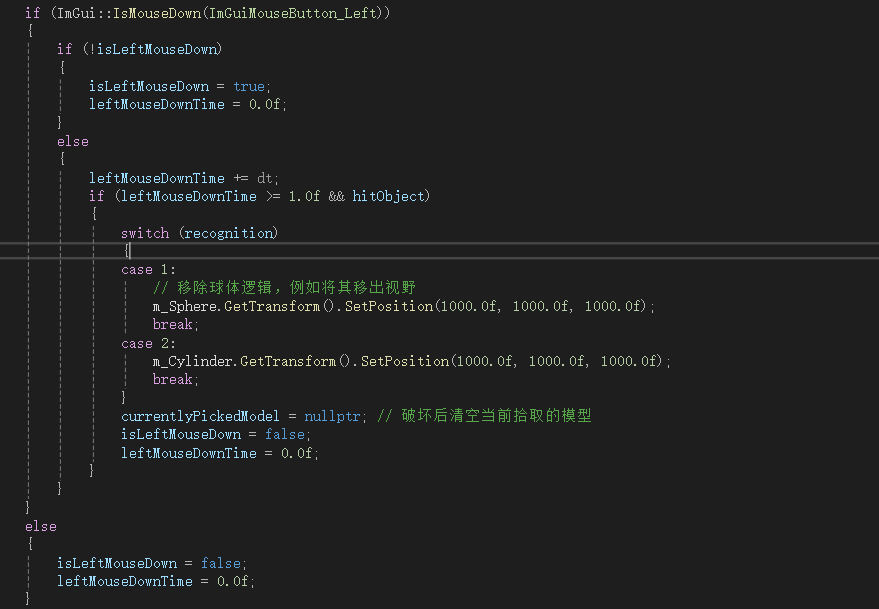

